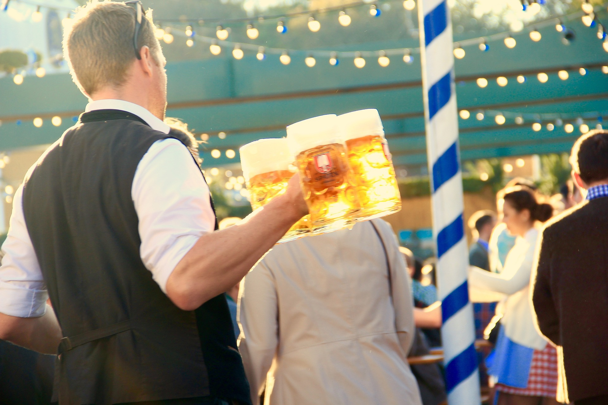
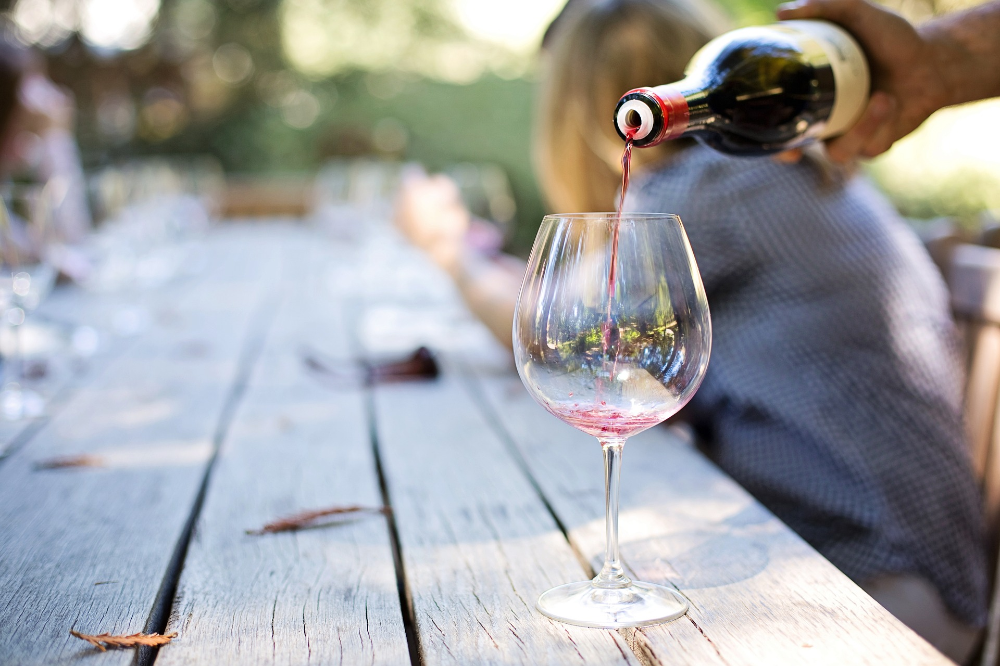

# Alkohole

## Drinki Bez alkoholu 

|Drinki|Cena|
|---|---|
|Martini Tonic| 17|
|Martinii Fiero 0% ,tonic|  |
|Piernik|   18|
|syrop piernikowy, mleczko kokosowe, , syrop czekoladowy, bita śmietana|  |
|Pinky|   22|
| pure truskawkowe, sok brzoskwiniowy, syrop malinowy, sok z limonki , sok żurawinowy, |     |
|French 75| 28|
|sok grapfruitowy, souer, sweet, proseco 0%| | 
|Ciemne Mojhito| 17|
|syrop imbirowy, limonka, sweet, ginger ale, mięta, sprite |  |
|Mojhito|  16|
|syrop mojhito , limonka, mięta, sweet, sprite |   |
|Sex Na Plaży|  17|
| sok brzoskwiniowy,  , sok pomarańczowy sweet, sok żurawinowy| |

## Piwo 0%

|               | DUŻE 550ml  |
|---|---|
|Lech|  15|          
|Karmi|13|                       
|Żywiec Jasny|15|
|Okocim| 15|

## Wina 0 %

|      |Lampka 0.2|  |  |
|---|---|---|---|
|  | 17| | |
|Wytrawne|Połwytrawne|Połsłodkie |Słodkie| 
|  |Białe|Czerwone|  | 
|Francuskie|Hiszpańskie|Włoskie|Polskie|

