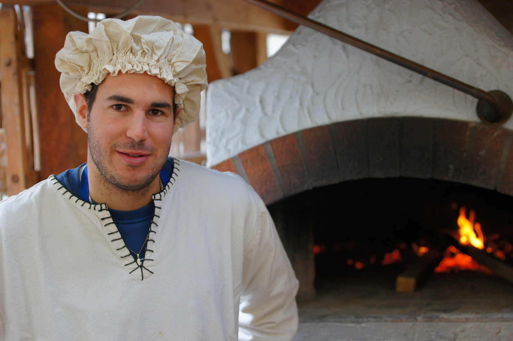

# Nasz Zespół

## Mi(d)as
Nasz Szef Kuchni, który czego się nie dotknie zamienia w złoto. Chciał iść w ślady Billa Gats’a i rzucił studia, jednak nie stowrzył nowego giganta komputerowego, a przepyszne i unikatowe ciasto na pizzę, które zdradzi tylko i wyłącznie swojemu odbiciu (chociaż i tutaj mamy wątpliwości)

## Janko
Nasz Muzykant, dba o muzykę, klimat, ozdoby, światełka i inne pierdoły,  współwłaściciel lokalu ale i tak usłyszymy od niego, “ ja tu tylko sprzątam “ 
Ps. NIKT GO NIGDY NIE WIDZIAŁ Z MIOTŁĄ 

## Ruda
Barmanka, która uśmiecha się tylko za odpowiedni napiwek, największy gangster lokalu. Charakterystyczne checzy masa tatuażów, złowrogi wzrok. Jednak spokojnie to tylko pozory. Jej serce topnieje za każdym razem jak widzi słodkie pieski. 

## Szefo
Koleś od wszystkiego, w zależności od dnia i humoru można go spotkać albo na sali, albo za barem, w kuchni czy w biurze. Drugi współwłaściciel. Pomysłodawca, filantrop, gentelman, opanowany, charyzmatyczny. (Tak on to sam pisał)  Próbuje tworzyć nasze sociale, ale trochę boomem z niego.

## Młoda
Przeważnie można ją zobaczyć w biegu z tacą w dłoni, lub nagrywająca TIKTOKI, ogarnie wszystko, od zmywaka przez salę do księgowości i sociali. Ona je głownie tworzy a Szefo próbuje jej pomagać.

## CHUDY
Koleś ogarniający sale, niech nie zrazi was jego wygląd, mimo szerokich na 2m barków, wielkiego bicepsa, to koleś który nie zrobi nikomu krzywdy. Zawsze uśmiechnięty i radosny. On nie mówi Dzień dobry, on od razu powie jakiś kawał. 

